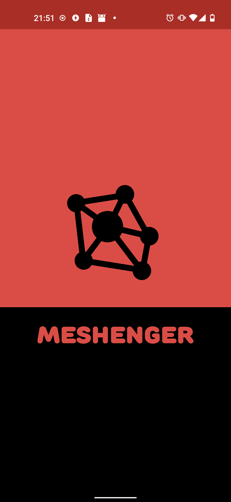
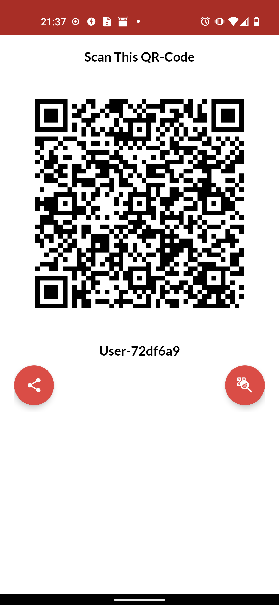
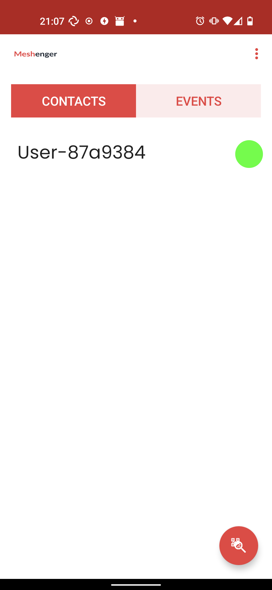
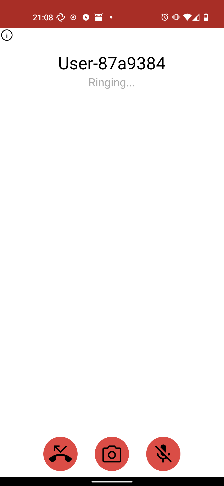
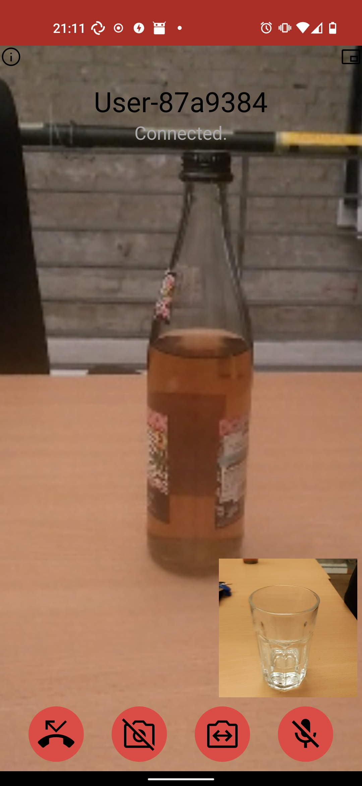

# YMesh

Live voice and video calls using the Yggdrasil Network. No account is required. Just scan the QR code, which will contain the IP address of the contact. This only works on mesh networks.

Features:

- voice and video calls
- encrypted communication
- no accounts, no registration, no servers
- Adding custom addresses to communicate with contacts

Limitations:

- IP address change requires manual updating of contacts

## Download

## Screenshots

    

## Documentation

Meshenger connects to IP addresses using the P2P principle. Contacts are encoded in a text blob that can be shared via QR code, picture or copy&paste. They contain a name, a public key and a list of IP addresses or domain names. The public key exchange is used to authenticate/encrypt signaling data to create a [WebRTC](https://webrtc.org/) session that can transmit voice and video.

Details can be found in [Documentation](docs/documentation.md) or [FAQ](docs/faq.md).

## Related projects

This list contains only open source projects.

* [linphone](https://linphone.org/) - uses SIP, can use IP addresses, but not easy to use
* [pion offline](https://github.com/pion/offline-browser-communication) - demonstration of standalone WebRTC
* [SideBand](https://github.com/markqvist/Sideband) - chat application based on the Reiculum network
* [Qaul](https://qaul.net/) - text messaging only, interconnected P2P network via BLE, Wifi and Internet-overlay
